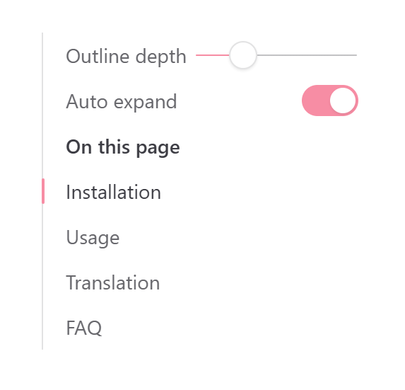

# vitepress-plugin-outline-depth

A [VitePress](https://vitepress.dev/) plugin that adds controls to the documentation sidebar (outline / table of contents), allowing readers to control how many heading levels are displayed in the page outline.

When the depth is set to `2`, only `<h2>` headings are shown; set it to `6` and all heading levels from `<h2>` through `<h6>` are visible. The **Auto Expand** toggle controls whether the outline automatically expands to reveal the section the reader is currently viewing. For example, with depth set to `2`, all other `<h2>` groups stay collapsed while the currently active section expands from its ancestor `<h2>` all the way down to the current heading.

> **Note:** When the outline depth is set to `6`, the Auto Expand toggle has no effect — since every heading level is already visible, expanding or collapsing makes no difference.

> **Important:** The maximum depth is subject to the default theme configuration `themeConfig.outline.level`. It is recommended to set it to the `"deep"` value.

## Screenshot

<div align="center">
  <picture>
    <source media="(prefers-color-scheme: dark)" srcset="./screenshots/screenshot-dark.png" />
    <source media="(prefers-color-scheme: light)" srcset="./screenshots/screenshot-light.png" />
    
  </picture>
</div>

## Installation

```bash
# npm
npm install vitepress-plugin-outline-depth
# yarn
yarn add vitepress-plugin-outline-depth
# pnpm
pnpm add vitepress-plugin-outline-depth
```

## Usage

Import the plugin in your VitePress config file (`.vitepress/config.ts`) and add it to the `vite.plugins` array:

```ts
import { defineConfig } from "vitepress";
import outlineDepthPlugin from "vitepress-plugin-outline-depth";

export default defineConfig({
  vite: {
    plugins: [outlineDepthPlugin(/* options */)],
  },
});
```

That's it. The plugin automatically injects its controls into the default VitePress theme and applies the necessary CSS.

## Configuration

The plugin accepts an optional `OutlineDepthPluginOptions` object. All properties are optional.

### `defaultDepth`

- **Type:** `2 | 3 | 4 | 5 | 6`
- **Default:** `2`

Sets the initial value of the outline depth slider — the number of heading levels visible in the outline.

If set to `6`, note that the Auto Expand toggle becomes effectively a no-op (all heading levels are visible regardless).

### `defaultAutoExpand`

- **Type:** `boolean`
- **Default:** `true`

Sets the initial state of the Auto Expand toggle. When enabled, the outline automatically expands to show the heading hierarchy around the currently active heading. When disabled, all headings beyond the set depth remain collapsed regardless of which section is being read.

### `minDepth`

- **Type:** `2 | 3 | 4 | 5 | 6`
- **Default:** `2`

The minimum value the outline depth slider can be set to. Must be less than `maxDepth`.

### `maxDepth`

- **Type:** `2 | 3 | 4 | 5 | 6`
- **Default:** `6`

The maximum value the outline depth slider can be set to. Must be greater than `minDepth`.

Note that the maximum depth is subject to the default theme configuration `themeConfig.outline.level`. It is recommended to set it to the `"deep"` value.

### `locales`

- **Type:** `Record<string, { depth: string; autoExpand: string }>`
- **Default:** `{}`

Custom translations for the UI labels. The plugin resolves the locale by matching against the VitePress site's `lang` setting. Built-in translations are provided for:

| Language | `depth` label | `autoExpand` label |
|----------|---------------|---------------------|
| English (`en`) | Outline depth | Auto expand |
| Simplified Chinese (`zh`) | 目录层级 | 自动展开 |

To add or override translations, pass a locale key:

```ts
outlineDepthPlugin({
  locales: {
    ja: {
      depth: "アウトラインの深さ",
      autoExpand: "自動展開",
    },
  },
});
```

The locale matching follows standard `Intl.Locale` fallback logic. For example, `zh-CN` falls back to `zh`, which is built-in. An unrecognized language falls back to English.

### `saveToLocalStorage`

- **Type:** `boolean`
- **Default:** `true`

When enabled, the reader's outline depth and auto-expand preferences are saved to `localStorage` and restored on subsequent page visits.

### `stickAtTop`

- **Type:** `boolean`
- **Default:** `true`

When enabled, the outline depth controls stick to the top of the sidebar outline area as the reader scrolls, so they remain accessible without scrolling back up.

### `scrollActiveOutlineLinkIntoView`

- **Type:** `boolean`
- **Default:** `true`

When enabled, the active outline link (the marker indicating the current heading) is automatically scrolled into view as the reader scrolls through the page content.

### `setConfigOutlineLevelToDeep`

- **Type:** `boolean`
- **Default:** `true`

When enabled, the `.vitepress.config.js/ts` user config `themeConfig.outline.level` will set to the `"deep"` value in every locales.

## Full Example

```ts
import { defineConfig } from "vitepress";
import outlineDepthPlugin from "vitepress-plugin-outline-depth";

export default defineConfig({
  lang: "en",
  vite: {
    plugins: [
      outlineDepthPlugin({
        defaultDepth: 2,
        defaultAutoExpand: true,
        minDepth: 2,
        maxDepth: 6,
        saveToLocalStorage: true,
        stickAtTop: true,
        scrollActiveOutlineLinkIntoView: true,
        locales: {
          ja: {
            depth: "アウトラインの深さ",
            autoExpand: "自動展開",
          },
        },
      }),
    ],
  },
});
```

## License

[MIT](LICENSE)
